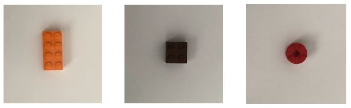

# Lego sorting — stage 1: raw image classifier

Three-class image classification of Lego pieces using a single-neuron classifier trained directly on raw pixel values.

## Problem

A sorting facility uses a camera on a conveyor belt to classify Lego pieces by shape and route them accordingly. The classifier must distinguish three piece types from their top-view images:

| Class | Shape | Size |
|-------|-------|------|
| Rectangle | Brick | 2×4 studs |
| Square | Brick | 2×2 studs |
| Circle | Plate | 2×2 round |

## Constraints

- **Input:** Raw RGB images (grayscale conversion and uniform scaling/cropping are permitted)
- **Model:** Single-neuron classifier (one set of weights applied to all pixels)
- **Parameter budget:** Fewer than 4 097 trainable weights
- **Data:** Pre-split into `training/` and `testing/` folders; folder and file names must not be changed

## Approach

Images are converted to grayscale and scaled to fit within the parameter budget. The flattened pixel vector is fed directly into a single-neuron (linear) model trained with logistic regression or a single-layer perceptron.

## Files

| File | Description |
|------|-------------|
| `lego-sorting-raw-images.ipynb` | Full solution notebook |
| `Lego.JPG` | Example images of the three Lego classes (centred, fixed orientation) |
