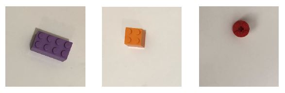

# Lego sorting — stage 2: engineered features

Three-class Lego classification extended to handle off-centre and rotated pieces using hand-engineered image features and a logistic regression classifier.

## Problem

Following stage 1, the sorting facility reported that real conveyor-belt images contain pieces at arbitrary positions and orientations — conditions the raw-pixel classifier cannot handle robustly. Stage 2 replaces the raw pixel input with engineered features that are invariant (or robust) to translation and rotation.

| Stage | Input | Classifier | Handles rotation / off-centre |
|-------|-------|------------|-------------------------------|
| 1 | Raw pixels | Single neuron | No |
| 2 | Engineered features | 3-class logistic regression | Yes |

## Constraints

- **Features:** Maximum 64 features per image (must be extracted/engineered, not raw pixels)
- **Model:** 3-class logistic regression (one-vs-rest)
- **Classes:** Same three as stage 1 — rectangle (2×4), square (2×2), circle (2×2 round)
- **Data:** Pre-split into `training/` and `testing/` folders

## Approach

Geometric and statistical features are extracted from each image (e.g., aspect ratio, moments, contour descriptors) to capture shape information independently of position and orientation. The feature vectors are used to train a `LogisticRegression` model from scikit-learn.

## Files

| File | Description |
|------|-------------|
| `lego-sorting-engineered-features.ipynb` | Full solution notebook |
| `Lego.JPG` | Stage 1 examples (centred, fixed orientation) |
| `Lego2.JPG` | Stage 2 examples (off-centre and rotated pieces) |
